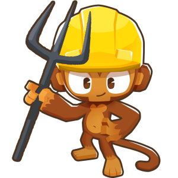
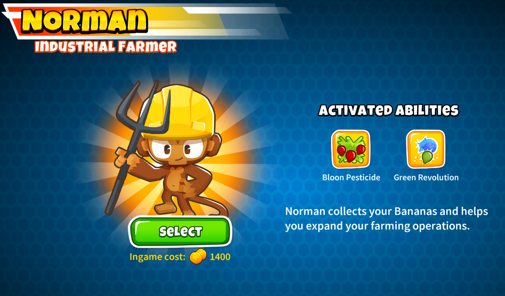

<h1 align="center">Norman, The Industrial Farmer</h1>

### This is my example custom hero for Bloons TD 6.

### Levels

1. Collects nearby bananas. Your next Banana Farm is free.
2. Collected Bananas are worth 10% more.
3. Spray Bloons in a large area with pesticide, damaging them over time.
4. All Banana Farms in radius get tier 1 upgrades for free.
5. Banana Farms can be placed on nearby water.
6. All Banana Farms in radius get tier 2 upgrades for free.
7. Range is increased.
8. Banana Farms in radius and their upgrades cost 10% less.
9. Collected Bananas are now worth 15% more.
10. Transforms some of the Largest Bloons on screen into Green Bloons. Targets up to BFBs.
11. Bloon Pesticide's damage over time is significantly increased.
12. Further increased range.
13. Collected Bananas Crates are now worth 20% more.
14. Bloon Pesticide makes Bloons take additional damage from attacks.
15. Banana Farms in radius and their upgrades now cost 20% less.
16. Green Revolution can hit more Bloons, including ZOMGs and DDTs.
17. Bloon Pesticide's damage over time is massively increased.
18. Further increased range.
19. Collected Bananas Crates are now worth 25% more.
20. Green Revolution affects even more Bloons and has reduced cooldown.

